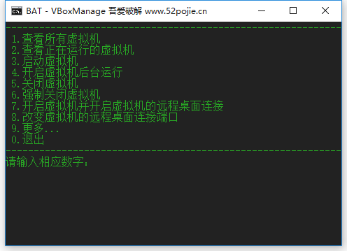
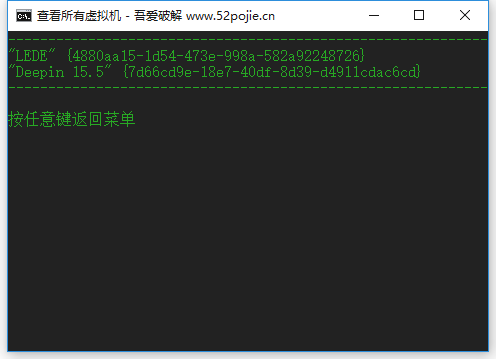

# bat-VBoxManage
- 使用批处理管理VirtualBox

## 明明有客户端为什么还要打命令？
> 最近在pc折腾软路由需要用到虚拟机，我觉得用命令比较方便，特别是一个命令就可以让虚拟机在后台运行

## 命令网上一搜就有了为什么还写？
> 折腾软由总会遇到断网的时候

## 小建议
- 适合有一定计算机操作基础的人使用

## 希望
- 欢迎lssues和star 😀

## 部分界面展示
> 
